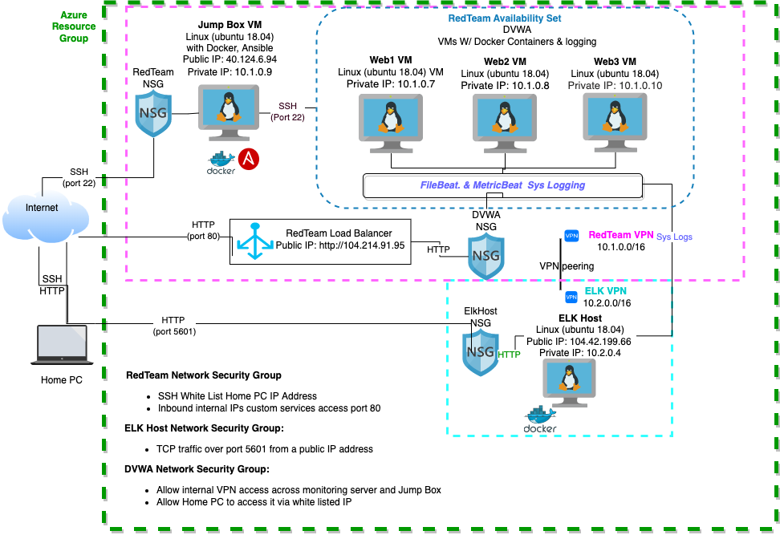

## Automated ELK Stack Deployment

The files in this repository were used to configure the network depicted below.


- Azure Resource Group with JumpBox, DVWA server & ELK Server: 


 

These files have been tested and used to generate a live ELK deployment on Azure. They can be used to either recreate the entire deployment pictured above. Alternatively, select portions of the `metricbeat-playbook.yml `& `metricbeat-config.yml` or `filebeat-playbook.yml` & `filebeat-config.yml` file may be used to install only certain pieces of it, such as Filebeat.

  - /etc/ansible/install-elk.yml 
  - /etc/ansible/files/filebeat-config.yml
  - /etc/ansible/files/metricbeat-config.yml
  - /etc/ansible/roles/filebeat-playbook.yml
  - /etc/ansible/roles/metricbeat-playbook.yml 


This document contains the following details:
- Description of the Topology 
- Access Policies
- ELK Configuration
  - Beats in Use
  - Machines Being Monitored
- How to Use the Ansible Build


### Description of the Topology

The main purpose of this network is to expose a load-balanced and monitored instance of DVWA, the D*mn Vulnerable Web Application.

Load balancing ensures that the application will be highly available, in addition to restricting access to the network.
- A **load balancer**  is an intelligent network security device that distributes that incoming network traffic across multiple servers.
- A load balancer ensures no single server has to handle too much traffic.
- Load balancers help protect the **availability** of resources.

The advantages of the Jump Box:
- The jump box prevents all Azure VM's to expose to the public. We can do monitoring and logging on a single box. 
- We can easily turn the ON/OFF remote desktop connectivity feature. 
- By using a network security group, we can restrict the IP addresses to communicate only with the Jump Box.


Integrating an ELK server allows users to easily monitor the vulnerable VMs for changes to the data and system logs.
- Filebeat monitors the log files from the vulnerable VMs, collects log events and forwards them to Elasticsearch/Logstash and then onto Kibana for visualization. 
- Metricbeat collect metrics from the virtual boxes systems and services. These system and services statistics are hten forwarded to Elasticsearch/Logstash and visualized in the Kibana web app. 

The configuration details of each machine are found below.


| Name     | Function | IP Address | Operating System |
|----------|----------|------------|------------------|
| Jump Box | Gateway  | 40.124.6.94| Linux (Ubuntu 18.04) |
| Web1     | Web Server |10.1.0.7            |Linux (Ubuntu 18.04) |
| Web2     | Web Server |10.1.0.8            |Linux (Ubuntu 18.04)|
| Web3     | Web Server |10.1.0.10     |Linux (Ubuntu 18.04)|
| ELK Host | Elastic (ELK Server) Monitoring |104.42.199.66 |Linux (Ubuntu 18.04)|

### Access Policies

The machines on the internal network are not exposed to the public Internet. 

Only the ELK Host machine can accept connections from the Internet. Access to this machine is only allowed from the following IP addresses:
- Home Machine IP on Ports 22 and 5601.

Machines within the network can only be accessed by the Jump Box Private IP on Port 22.

A summary of the access policies in place can be found in the table below.

| Name     | Publicly Accessible | Allowed IP Addresses |
|----------|---------------------|----------------------|
| Jump Box | Yes                 | Home Machine IP on Port 22   |
| Web1     | No                  | 10.1.0.9 on Port 22 |
| Web2     | No                  | 10.1.0.9 on Port 22 |
| Web3     | No                  | 10.1.0.9 on Port 22 |
| ELK Host | Yes                 | Home Machine IP on Port 5601 |

### Elk Configuration

Ansible was used to automate configuration of the ELK machine. No configuration was performed manually, which is advantageous because machines can be brought online with provisioning and management of computing infrastructure and related configuration through machine-processable definition files.

The playbook implements the following tasks:
- Install Docker
- Increase virtual memory memory and set the machine to use it 
- Download an ELK image and start it on ports 5601, 9200, 5044

The following screenshot displays the result of running `docker ps` after successfully configuring the ELK instance.

 

### Target Machines & Beats
This ELK server is configured to monitor the following machines:


| Name     | Function | IP Address | Operating System |
|----------|---------------------|----------------------|
| Web1     | Web Server |10.1.0.7            |Linux (Ubuntu 18.04) |
| Web2     | Web Server |10.1.0.8            |Linux (Ubuntu 18.04)|
| Web3     | Web Server |10.1.0.10     |Linux (Ubuntu 18.04)|


We have installed the following Beats on these machines:
- Filebeat
- Metric Meat 

These Beats allow us to collect the following information from each machine:
- Filebeat monitors the log files from the vulnerable VMs, collects log events and forwards them to Elasticsearch/Logstash and then onto Kibana for visualization. 
- Metricbeat collect metrics from the virtual boxes systems and services. These system and services statistics are hten forwarded to Elasticsearch/Logstash and visualized in the Kibana web app. 

### Using the Playbook
In order to use the playbook, you will need to have an Ansible control node already configured. Assuming you have such a control node provisioned: 

SSH into the control node and follow the steps below:
- Copy the `install-elk.yml` file to ```/etc/ansible```.
- Update the _____ file to include...
- Run the playbook, and navigate to ____ to check that the installation worked as expected.

_TODO: Answer the following questions to fill in the blanks:_
- _Which file is the playbook? Where do you copy it?_
- _Which file do you update to make Ansible run the playbook on a specific machine? How do I specify which machine to install the ELK server on versus which to install Filebeat on?_
- _Which URL do you navigate to in order to check that the ELK server is running?

_As a **Bonus**, provide the specific commands the user will need to run to download the playbook, update the files, etc._